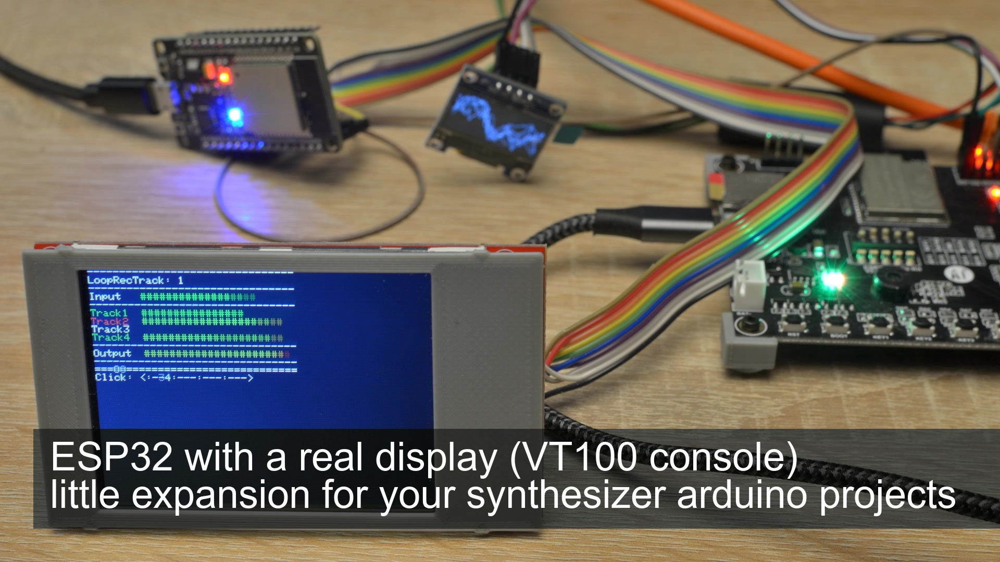
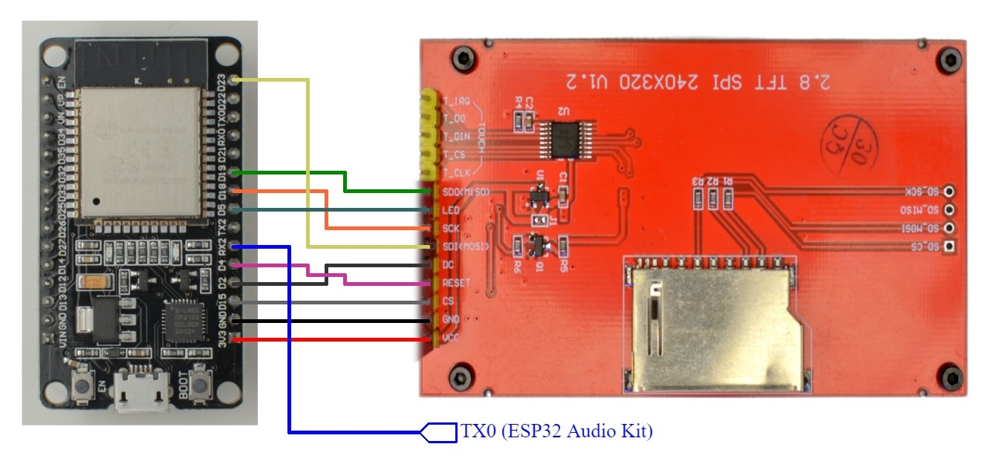

<h1 align="center">simple_vt100_tft_display</h1>
<h3 align="center">ESP32 with a real display (VT100 console) - little expansion for your synthesizer arduino projects</h3>  

 
   
  <a href="https://youtu.be/1I_dJHwim2w">link to the video</a>

Arduino project to show VT100 output on an extern TFT display like the IL9341

# Required libraries:
- https://github.com/Bodmer/TFT_eSPI

# Preparation
Go into the library folder "TFT_eSPI" and open "User_Setup.h"

Replace

	#define TFT_CS   PIN_D8  // Chip select control pin D8
	#define TFT_DC   PIN_D3  // Data Command control pin
	#define TFT_RST  PIN_D4  // Reset pin (could connect to NodeMCU RST, see next line)

by:

	//#define TFT_CS   PIN_D8  // Chip select control pin D8
	//#define TFT_DC   PIN_D3  // Data Command control pin
	//#define TFT_RST  PIN_D4  // Reset pin (could connect to NodeMCU RST, see next line)

and go down to 

	// For ESP32 Dev board (only tested with ILI9341 display)
	// The hardware SPI can be mapped to any pins
	
and replace

	//#define TFT_MISO 19
	//#define TFT_MOSI 23
	//#define TFT_SCLK 18
	//#define TFT_CS   15  // Chip select control pin
	//#define TFT_DC    2  // Data Command control pin
	//#define TFT_RST   4  // Reset pin (could connect to RST pin)

by

	#define TFT_MISO 19
	#define TFT_MOSI 23
	#define TFT_SCLK 18
	#define TFT_CS   15  // Chip select control pin
	#define TFT_DC    2  // Data Command control pin
	#define TFT_RST   4  // Reset pin (could connect to RST pin)

# Schematic

